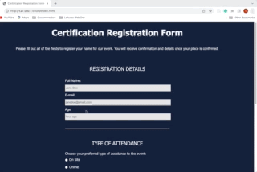

# CERTIFICATION REGISTRATION FORM APP

The registration form application was built as a certification project for a responsive web design course with FreecodeCamp. It features a registration form to
a training event for chefs.

 ## Features
 
 - Input fields for text
 - Input field for email that will not take answers without the janedoe@email.com format
 - Input types to select options type radio and type checkbox
 - Link to terms and conditions
 - Input field type for numbers
 - Input type to select options between different values
 - A landing page for when pushing the submit button

## Technologies

- HTML
- CSS

## Start the App

In the project directory, you can run it with the Live Server by right-clicking on the index.html.

It will run the app in the development mode.\
Open [http://127.0.0.1:5500](http://127.0.0.1:5500/index.html) to view it in your browser.

When making changes, make sure you reload to see it on the page.

### Author

[Tanimara Elias Santos](https://github.com/tanimaraeliassantos)

### Version

1.0.0

 
